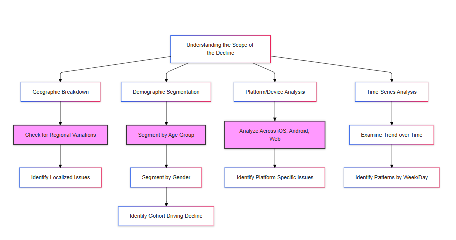
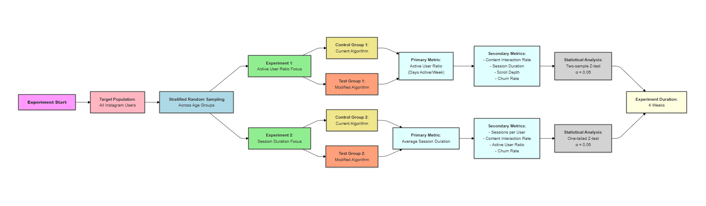

## Analytical Execution Interview Examples

**Introduction:**

This document provides *AI-generated example solutions* to hypothetical analytical execution interview questions. It is intended to serve as a resource for candidates to understand the type of thinking, problem-solving approach, and level of detail expected in such interviews at Meta. *The answers provided are generated by an AI and should not be considered definitive or the only correct approach. They are meant to illustrate one possible way of structuring a response and should be used as a guide to develop your own problem-solving skills and critical thinking.*

---

 

### Example 1: Instagram DAU Decline

**Interviewer:** Hi, thanks for joining me today. Let's dive into our scenario. Imagine you're a Data Scientist on the Instagram Growth team. We've observed a concerning trend: a 10% decrease in daily active users (DAU) over the past month. This is obviously a significant issue for us. How would you approach investigating this decline?

**Candidate:**

Thank you for having me. A 10% drop in DAU is definitely a serious concern. My initial approach would focus on understanding the scope and potential drivers of this decline before formulating any solutions. Here's how I would break down my investigation:

**1. Understanding the Scope of the Decline:**

*   **Geographic Breakdown:** First, I'd want to see if this decline is uniform across all geographic regions or if it's concentrated in specific areas. A significant drop in one region might point to a localized issue, such as a new competitor, a cultural event, or a change in local regulations.
*   **Demographic Segmentation:**  Next, I'd segment the DAU decline by different age groups, genders, and other relevant demographics. This helps us understand if a particular user cohort is driving the decline. For instance, a drop among younger users might suggest issues with engagement or competition, while a decline in older users could point to usability problems or changing social media habits.
*   **Platform/Device Analysis:**  I'd also analyze the decline across different platforms (iOS, Android, Web) and device types. A drop specific to one platform could indicate a technical issue or a platform-specific competitor.
*   **Time Series Analysis:**  It would be crucial to examine the trend of the decline over time. Was it a sudden drop, a gradual decline, or a fluctuating pattern? This can help us understand the potential cause. A sudden drop might suggest a specific event like an outage or negative press. A gradual decline may indicate a growing problem with user engagement or competition. We should also examine whether the decline is uniform across all days of the week or specific to weekends or weekdays, to find any patterns.

Here is a breakown of my process:

**2. Investigating Potential Causes:**

*   **Recent Changes:** I'd work with product and engineering teams to create a timeline of any recent changes to the Instagram platform, including algorithm updates, feature launches/removals, UI/UX changes, and marketing campaigns. We need to understand if any of these changes correlate with the DAU decline.
*   **Competitive Landscape:** I'd research the social media landscape to identify any new competitors, changes in competitor strategies, or shifts in user preferences. A new entrant or a successful campaign by an existing competitor could be drawing users away from Instagram.
*   **External Factors:**  I'd investigate any external factors that might be impacting user behavior, such as major news events, social media trends, regulatory changes, or even seasonal effects.
*   **User Feedback:** I would analyze user feedback from various sources, such as app store reviews, social media mentions, and customer support tickets, to identify any recurring complaints or issues. Sentiment analysis could be valuable here to gauge user sentiment towards recent changes or the platform in general.

**3. Data Sources:**

To conduct this investigation, I would need access to various data sources, including:

*   **User Activity Logs:** This is the primary source, providing data on user logins, sessions, content interactions, and demographic information.
*   **Product/Engineering Change Logs:** To track platform updates and correlate them with the DAU decline.
*   **Marketing Campaign Data:** To assess the impact of recent marketing efforts.
*   **Competitive Intelligence Data:**  To understand the competitive landscape and identify potential threats.
*   **External Data Sources:**  News APIs, social media listening tools, and app store analytics to monitor external factors and user sentiment.

**Interviewer:** That's a good starting point. Let's say we've done some initial analysis, and here's what we found: the 10% decline isn't uniform. North America and Europe are down 15%, Asia-Pacific is down only 5%, and Latin America is relatively stable. Also, the decline is most pronounced in the 18-24 age group, with a 20% decrease. As for recent changes, there have been a few: a new competitor called "SnapFlash" launched in North America and Europe, we implemented an algorithm change aimed at promoting more diverse content, and there was a widely publicized privacy concern related to data usage on the platform.

**Candidate:**

This is very insightful. It seems we have some strong indicators pointing to potential causes. Here's how I'd proceed, given this new information:

**1. Prioritizing Areas of Investigation:**

*   **Geographic Focus:**  We should prioritize North America and Europe, as these regions are experiencing the most significant decline.
*   **Demographic Focus:** The 18-24 age group should be our primary focus, as they are the most affected demographic. However, we need to be mindful of potential impacts on other demographics.
*   **Potential Causes:** The new competitor ("SnapFlash"), the algorithm change, and the privacy concern are all plausible factors, but given the demographic and geographic patterns, the competitor and the algorithm change seem most likely to be directly related to our problem.

**2. Developing Hypotheses:**

Based on the information, I would formulate the following hypotheses:

*   **Hypothesis 1 (Competition):** The launch of "SnapFlash" in North America and Europe has drawn users away from Instagram, particularly within the 18-24 age group.
*   **Hypothesis 2 (Algorithm Change):** The recent algorithm change, aimed at promoting diverse content, has inadvertently reduced the visibility of content that is highly engaging for the 18-24 age group in North America and Europe, leading to decreased user satisfaction and a decline in DAU.
*   **Hypothesis 3 (Privacy Concerns):** The recent publicity around privacy concerns has negatively impacted user trust and contributed to the decline in DAU, particularly among the privacy-conscious 18-24 age group in North America and Europe.

**3. Focusing on the Algorithm Change for an Experiment:**

While all three hypotheses are worth investigating, I propose we focus on **Hypothesis 2 (Algorithm Change)** for a deeper dive and a potential experiment. Here's why:

*   **Controllability:** We have direct control over our algorithm, whereas we can't directly control competitor actions or completely mitigate the impact of past privacy concerns in the short term.
*   **Potential for Quick Impact:** Algorithm changes can be implemented and tested relatively quickly, allowing us to see results and iterate faster.
*   **Targeted Solution:** If the algorithm change is a significant driver, addressing it could have a substantial positive impact on reversing the DAU decline, especially within our target demographic.

**4. Proposed Experiment: A/B Test of Algorithm Modification**

To test Hypothesis 2, I propose running an A/B test with the following framework:

*   **Goal:** To determine if a modified algorithm, designed to increase engagement among the 18-24 age group in North America and Europe, can positively impact the active user ratio (a proxy for DAU), while not negatively impacting other demographics.

*   **Target Population:** All Instagram users, with a focus on analyzing the impact across different age groups.

*   **Control Group:** A randomly selected group of users across all demographics will continue to experience the current algorithm (with the recent change promoting diverse content).

*   **Experimental Group:** A randomly selected group of users across all demographics will experience a modified algorithm.

*   **Algorithm Modification Framework:**
    *   We will not revert to the old algorithm completely, as it had its own issues.
    *   Instead, we will focus on increasing the visibility of content that has historically performed well (high engagement in terms of likes, comments, shares, saves, and watch time) within the 18-24 demographic in North America and Europe *before* the recent algorithm change.
    *   We can use a weighted ranking system that combines factors like content recency, relevance to the user's past interactions (e.g., accounts followed, content liked/commented on), and overall popularity within the target demographic.
    *   We might also consider incorporating elements of trending or viral content *within* the 18-24 demographic to capture current interests.
    *   The key is to find a balance between personalization (based on user's past behavior) and discovery (exposure to new but still relevant content).
    *   Essentially, we are creating a "linked list" of content that is popular within the target demographic and using that to inform our algorithm. We will use this same framework for each demographic, but our primary focus will be on the 18-24 demographic.

*   **Sampling:** We will use stratified random sampling across *all* age groups (e.g., 13-17, 18-24, 25-34, 35-44, 45-54, 55+) to ensure each demographic is proportionally represented in both the control and experimental groups.

*   **Primary Metric: Active User Ratio**
    *   **Definition:** The proportion of days a user is considered "active" in a given week (or month).
    *   **"Active" Definition:** A user is considered "active" on a given day if they log into the app (on any platform) for at least 5 seconds. This captures intentional usage beyond just accidentally opening the app.
    *   **Calculation:** (Number of days a user is active in a week) / 7. We will calculate this weekly and also look at the average over the course of the experiment.
    *   **Why this metric?:** It directly relates to DAU, is sensitive enough to capture changes within a relatively short experiment, and reflects the frequency of user engagement.

*   **Secondary Metrics:**
    *   **Content Interaction Rate:** (Likes + Comments + Shares + Saves) / Impressions. This will help us understand how users are engaging with the content surfaced by the algorithm.
    *   **Average Session Duration:** The average length of time a user spends on the platform per session. While not the primary metric, it can provide insights into overall engagement levels.
    *   **Scroll Depth:** A measure of how far users scroll down their feeds, indicating content discoverability and engagement.
    *   **Churn Rate:** The proportion of users who become inactive during the experiment. This is a longer-term metric but important to track.

*   **Hypotheses:**
    *   **Null Hypothesis:** The modified algorithm has no significant impact on the active user ratio compared to the current algorithm, overall and within each age group.
    *   **Alternative Hypothesis:** The modified algorithm has a statistically significant positive impact on the active user ratio compared to the current algorithm, particularly for the 18-24 age group, without negatively impacting other demographics.

*   **Statistical Analysis:**
    *   We will use a two-sample z-test for proportions to compare the active user ratio between the control and experimental groups, overall and for each age group.
    *   We will set a significance level (alpha) of 0.05 (95% confidence level).
    *   We will calculate the p-value and compare it to the significance level to determine whether to reject or fail to reject the null hypothesis.
    *   We will also calculate the effect size (e.g., Cohen's d) to understand the magnitude of the difference between the two groups.

*   **Duration:** We will run the experiment for 4 weeks (one month). This should be sufficient time to observe meaningful changes in user behavior while minimizing the risk of external factors significantly skewing the results.

*   **Power Analysis:** Before launching the experiment, we will conduct a power analysis to determine the required sample size for each group. We'll aim for a power of at least 0.8 (80%), which means we have an 80% chance of detecting a true effect if one exists. The power analysis will take into account our desired significance level (0.05), estimated effect size (based on historical data or a pilot study), and the variability of our primary metric (active user ratio). Using these inputs, we can calculate the minimum sample size needed per group.

*   **Data Collection and Example Mathematical Solution:**
We will continuously track the active user ratio for each user in both groups throughout the experiment. We will also collect data on the secondary metrics mentioned earlier. We will calculate the active user ratio weekly to monitor any trends and make adjustments if necessary (e.g., if we see a very large negative impact on the experimental group).

Let's illustrate the statistical analysis with a concrete example using synthetic data.

*   **Sample Data (Synthetic):**
    *   Control Group (A): $n_A = 5000$ users, $x_A = 2500$ active users
    *   Experimental Group (B): $n_B = 5000$ users, $x_B = 2750$ active users

*   **1. Calculate Observed Proportions:**

    *   $\hat{p}_A = \frac{x_A}{n_A} = \frac{2500}{5000} = 0.5$
    *   $\hat{p}_B = \frac{x_B}{n_B} = \frac{2750}{5000} = 0.55$

*   **2. Calculate the Pooled Proportion ($\hat{p}$):**

    $\hat{p} = \frac{x_A + x_B}{n_A + n_B} = \frac{2500 + 2750}{5000 + 5000} = \frac{5250}{10000} = 0.525$

*   **3. Calculate the Standard Error of the Difference (SE):**

    $SE = \sqrt{\hat{p}(1 - \hat{p}) \left(\frac{1}{n_A} + \frac{1}{n_B}\right)} = \sqrt{0.525(1 - 0.525) \left(\frac{1}{5000} + \frac{1}{5000}\right)} \approx 0.00707$

*   **4. Calculate the Z-score:**

    $Z = \frac{\hat{p}_B - \hat{p}_A}{SE} = \frac{0.55 - 0.5}{0.00707} \approx 7.07$

*   **5. Calculate the p-value (One-tailed Test - Right-tailed):**

    For a *one-tailed* (right-tailed) test, we only consider the probability of getting a Z-score *greater* than our calculated Z.

    $p\text{-value} = P(Z > 7.07) \approx 0$

    (This is because the probability of getting a Z-score this high is extremely close to zero.)

*   **6. Make a Decision:**

    Our chosen significance level ($\alpha$) is 0.05. Since our calculated p-value (approximately 0) is much less than 0.05:

    $0 < 0.05$

    We reject the null hypothesis.

*   **7. Interpretation:**

    We have strong statistical evidence to conclude that the modified algorithm has a statistically significant *positive* impact on the active user ratio. The observed increase from 50% to 55% is highly unlikely to have occurred by chance.

    **Effect Size:**

    The absolute effect size is:

    $\hat{p}_B - \hat{p}_A = 0.55 - 0.5 = 0.05$ or a 5% increase.

    This means the modified algorithm resulted in a 5 percentage point increase in the active user ratio. Whether this is a practically significant effect depends on business context and goals.

**Alternative Experiment:**: **A/B Test of Algorithm Modification Focus on Average Session Duration**

*   **Goal:** To determine if a modified algorithm, designed to increase engagement among the 18-24 age group in North America and Europe, can positively impact the *average session duration*, while not negatively impacting other demographics.

*   **Target Population:** All Instagram users, with a focus on analyzing the impact across different age groups.

*   **Control Group:** A randomly selected group of users across all demographics will continue to experience the current algorithm.

*   **Experimental Group:** A randomly selected group of users across all demographics will experience the modified algorithm (as described in the previous response – focused on increased visibility of historically engaging content for the 18-24 demographic).

*   **Primary Metric: Average Session Duration:**
    *   **Definition:** The average time (in seconds or minutes) a user spends in a single app session.
    *   **Calculation:** Total session time for all users in the group / Number of sessions in the group.

*   **Secondary Metrics:**
    *   **Number of Sessions per User:** To ensure the increase in session duration isn't simply due to users having fewer, but longer, sessions.
    *   **Content Interaction Rate (Likes, Comments, Shares, Saves):** To check if longer sessions also lead to more interaction with content.
    *   **Active User Ratio:** To ensure that the change in session duration does not negatively impact the number of active users.
    *   **Churn Rate:** The proportion of users who become inactive during the experiment.

*   **Hypotheses:**
    *   **Null Hypothesis (H0):** The modified algorithm has no significant *positive* impact on average session duration. Mathematically: $\mu_B \le \mu_A$ or $\mu_B - \mu_A \le 0$
    *   **Alternative Hypothesis (H1):** The modified algorithm has a statistically significant *positive* impact on average session duration. Mathematically: $\mu_B > \mu_A$ or $\mu_B - \mu_A > 0$
        Where:
        *   $\mu_A$ is the average session duration of the control group.
        *   $\mu_B$ is the average session duration of the experimental group.

*   **Statistical Analysis:**
    *   We will use a one-tailed (right-tailed) two-sample Z-test if we can assume the session duration data is approximately normally distributed (after handling outliers). If the data is not normally distributed, a non-parametric test like the Mann-Whitney U test could be used. Given the large sample sizes we would use a Z test.
    *   We will set a significance level ($\alpha$) of 0.05.
    *   We will calculate the p-value and compare it to $\alpha$.
    *   We will also calculate the effect size (e.g., Cohen's d) to quantify the magnitude of the difference.

    Let's illustrate the statistical analysis with synthetic data.

*   **Sample Data (Synthetic):**
    *   Control Group (A): $n_A = 10000$ sessions, average session duration $\bar{x}_A = 300$ seconds, sample standard deviation $s_A = 100$ seconds.
    *   Experimental Group (B): $n_B = 10000$ sessions, average session duration $\bar{x}_B = 315$ seconds, sample standard deviation $s_B = 105$ seconds.

*   **1. Calculate the Pooled Standard Deviation:**

    Since our sample sizes are large we use the sample standard deviations to calculate the standard error.

*   **2. Calculate the Standard Error of the Difference (SE):**

    $SE = \sqrt{\frac{s_A^2}{n_A} + \frac{s_B^2}{n_B}} = \sqrt{\frac{100^2}{10000} + \frac{105^2}{10000}} \approx \sqrt{1.0 + 1.1025} \approx 1.45$

*   **3. Calculate the Z-score:**

    $Z = \frac{\bar{x}_B - \bar{x}_A}{SE} = \frac{315 - 300}{1.45} \approx 10.34$

*   **4. Calculate the p-value (One-tailed Test - Right-tailed):**

    $p\text{-value} = P(Z > 10.34) \approx 0$ (Extremely close to zero)

*   **5. Make a Decision:**

    With $\alpha = 0.05$, since $p\text{-value} \approx 0 < 0.05$, we reject the null hypothesis.

*   **6. Interpretation:**

    There is very strong statistical evidence that the modified algorithm has a statistically significant *positive* impact on average session duration. The observed increase of 15 seconds is highly unlikely to have occurred by chance.

    **Effect Size (Cohen's d):**

    $d = \frac{\bar{x}_B - \bar{x}_A}{s_{pooled}}$

    Where $s_{pooled} = \sqrt{\frac{(n_A - 1)s_A^2 + (n_B - 1)s_B^2}{n_A + n_B - 2}} \approx \sqrt{\frac{9999*10000 + 9999*11025}{19998}} \approx 102.5$

    $d = \frac{315 - 300}{102.5} \approx 0.15$

    This is considered a small effect size, indicating that while the increase is statistically significant, the practical impact on session duration might be modest.

The key change is the focus on Average Session Duration as the primary metric and the corresponding use of a Z-test for means. The example calculation now uses means and standard deviations, and the effect size is calculated using Cohen's d, which is appropriate for comparing means. The interpretations are also adjusted to reflect the change in metric.

**5. Addressing Potential Concerns:**

*   **SnapFlash Competition:** While we can't directly control SnapFlash's actions, we will monitor their activity during the experiment (e.g., major marketing campaigns, feature launches) and consider any potential impact on our results. We can also segment our analysis to see if the impact of our algorithm change differs between users who have and haven't used SnapFlash (if we have data on that).
*   **Privacy Concerns:** We will ensure that any data collection and analysis for this experiment adhere to Instagram's privacy policies and ethical guidelines. We will also monitor user sentiment related to privacy during the experiment to see if it has any bearing on our results.
*   **Ethical Considerations:** Although we are modifying the algorithm, it is being done with the intent of improving user experience. We are not reverting to a known bad algorithm, but testing a potentially better one. Also, the changes will be temporary, only for the duration of the experiment.

**6. Post-Experiment Analysis:**

*   If the experiment shows a statistically significant positive impact on the active user ratio in the experimental group, especially within the 18-24 age group, and no significant negative impact on other age groups, we will conduct a deeper analysis to understand which aspects of the modified algorithm were most effective. We'll examine the secondary metrics (content interaction rate, session duration, etc.) to gain further insights.
*   We will also consider a gradual rollout of the modified algorithm to the wider population, monitoring key metrics closely to ensure the positive impact is sustained.
*   If the experiment does not show a significant impact or shows a negative impact, we will analyze the data to understand why and potentially iterate on the algorithm or explore other hypotheses (e.g., the impact of SnapFlash or the privacy concerns).

**7. Further Considerations**

*   It is important to keep in mind that user behavior can change over time, so it is important to regularly monitor the performance of the algorithm and make adjustments as needed.
*   It is also important to consider the long-term impact of any algorithm changes on user engagement and satisfaction. While increasing the active user ratio is a key goal, it should not come at the expense of user experience or trust.

This detailed approach provides a solid framework for investigating the DAU decline and testing a potential solution. By carefully designing and executing the A/B test, and analyzing the results, we can gain valuable insights into user behavior and make data-driven decisions to improve the Instagram platform. This is a complex problem, and this experiment is just one step in the process of understanding and addressing the DAU decline. We will likely need to continue iterating and experimenting to find the optimal solution.

---

 

### Example 2: Facebook Marketplace - Declining Transaction Volume

**Scenario:** Facebook Marketplace has become a significant part of the Facebook ecosystem, allowing users to buy and sell goods locally. However, in the past quarter, we've seen a 5% decrease in successful transaction volume on Marketplace in the United States.

**Interview Question:** You are a Data Scientist on the Facebook Marketplace team. How would you approach investigating this decline in transaction volume, and what potential solutions might you explore?

**Candidate Response:**

"Thanks for the opportunity to discuss this challenge. A 5% decline in transaction volume on Marketplace is definitely concerning, especially in a key market like the U.S. I would approach this problem by first thoroughly understanding the nature of the decline and then generating data-driven hypotheses, which I would then validate before proposing any solutions. Here's my step-by-step approach:

**Phase 1: Diagnosing the Decline - Understanding the "What"**

1.  **Time Series Analysis:**
    *   I'd start by examining the trend of the decline over the past quarter, and even further back, to see if this is a sudden drop, a gradual decline, or part of a recurring seasonal pattern.
    *   I'd also look for any specific dates or weeks where the decline was particularly pronounced. This could help pinpoint potential triggers.
    *   I would decompose the time series into its components (trend, seasonality, cyclical, and irregular component) to isolate the trend from seasonal effects and identify potential anomalies.

2.  **Segmentation:** I would segment the transaction volume decline along various dimensions to understand if it's affecting all users and product categories uniformly or if it's concentrated in specific areas:
    *   **Product Categories:** Are certain product categories (e.g., electronics, furniture, apparel) experiencing a more significant decline than others?
    *   **Seller/Buyer Demographics:** Is the decline more pronounced among specific age groups, genders, or other user demographics?
    *   **Geographic Location:** Are certain cities or regions within the U.S. driving the decline?
    *   **Platform:** Is the decline happening across all platforms (iOS, Android, Web), or is it specific to one or two?
    *   **User Engagement Levels:** Is the decline concentrated among highly active Marketplace users, or is it affecting less active users more? We could segment users into cohorts based on their past Marketplace activity.
    *   **Price Range:** Is the decline impacting lower-priced items more than higher-priced goods or vice versa?

3.  **Funnel Analysis:** I would analyze the user journey on Marketplace, from browsing to listing to completed transactions, to identify where potential drop-offs are occurring.
    *   Are fewer users listing items?
    *   Are fewer users initiating conversations about listings?
    *   Are fewer conversations converting into successful transactions?

**Phase 2: Investigating Potential Causes - Understanding the "Why"**

Once I have a clearer picture of the "what," I would move on to investigating the "why" behind the decline.

1.  **Recent Changes:**
    *   I'd work closely with the product, engineering, and marketing teams to compile a comprehensive list of any changes made to Marketplace in the past quarter. This includes algorithm updates, UI/UX changes, policy changes, new feature launches, and marketing campaigns.
    *   I would pay close attention to the dates these changes were implemented to establish any potential correlations with the decline.

2.  **Competitive Landscape:**
    *   I'd research the local e-commerce and classifieds landscape to identify any new competitors, changes in competitor strategies (e.g., pricing, promotions, new features), or shifts in consumer preferences.
    *   I would analyze app store data, social media mentions, and industry reports to understand the competitive dynamics.

3.  **External Factors:**
    *   I would investigate any external factors that could be impacting Marketplace usage, such as economic downturns, changes in consumer confidence, seasonality, or major events in the U.S. that could influence buying and selling behavior.
    *   For example, rising inflation could affect demand for non-essential goods.

4.  **User Feedback:**
    *   I'd analyze user feedback from various sources: app store reviews, social media mentions, customer support tickets, and any in-app feedback mechanisms.
    *   I'd use sentiment analysis and topic modeling to identify recurring themes and pain points in user feedback, which could shed light on potential reasons for the decline.

**Phase 3: Hypothesis Generation and Validation**

Based on the insights gathered in Phases 1 and 2, I would formulate specific, testable hypotheses about the primary drivers of the decline. For example:

*   **Hypothesis 1:** A recent algorithm change aimed at improving search relevance on Marketplace has inadvertently reduced the visibility of listings in certain product categories, leading to a decrease in transactions within those categories.
*   **Hypothesis 2:** A new competitor offering lower transaction fees or a more streamlined user experience is attracting sellers and buyers away from Marketplace, particularly in specific geographic regions.
*   **Hypothesis 3:**  Economic factors, such as inflation or decreased consumer spending, are impacting demand for used goods, leading to a decline in Marketplace transactions, especially for higher-priced items.

**Phase 4: Solution Exploration and Prioritization**

Once I have validated or invalidated my hypotheses, I can start to explore potential solutions.

*   **If Hypothesis 1 is validated:**
    *   I would work with the engineering team to investigate the algorithm change and potentially roll back or refine it.
    *   I would propose an A/B test to evaluate different algorithmic approaches to optimize for both search relevance and transaction volume.

*   **If Hypothesis 2 is validated:**
    *   I would conduct further research to understand the competitor's value proposition and identify areas where Marketplace could improve its offerings.
    *   I would explore options such as adjusting transaction fees, enhancing the user interface, or introducing new features to increase competitiveness.

*   **If Hypothesis 3 is validated:**
    *   I would investigate ways to highlight value and affordability on Marketplace, such as promoting lower-priced items or offering financing options.
    *   I would work with the marketing team to develop targeted campaigns that address consumer concerns related to the economic climate.

**Prioritization Framework:**

To prioritize potential solutions, I would use a framework based on:

*   **Impact:** How much potential does the solution have to increase transaction volume?
*   **Effort:** How much time, resources, and engineering effort are required to implement the solution?
*   **Cost:** What are the financial costs associated with the solution (e.g., development, marketing)?
*   **Risk:** What are the potential risks or unintended consequences of implementing the solution?

I would then prioritize solutions that offer the highest potential impact with the lowest effort, cost, and risk.

**Phase 5: Experimentation and Iteration**

*   For any significant changes or new features, I would strongly advocate for A/B testing to measure their impact on transaction volume and other key metrics (e.g., user engagement, listing volume, conversion rates).
*   I would continuously monitor the performance of Marketplace, track key metrics, and iterate on solutions based on data and user feedback.

**Data Sources:**

Throughout this process, I would rely on a variety of data sources, including:

*   **Marketplace Transaction Data:** This would be the primary source, providing information on transaction volume, product categories, prices, seller/buyer demographics, and geographic location.
*   **User Activity Logs:** To understand user behavior on Marketplace, including browsing patterns, search queries, listing creation, and communication between buyers and sellers.
*   **Product/Engineering Change Logs:** To track platform updates and correlate them with changes in transaction volume.
*   **Marketing Campaign Data:** To assess the impact of any marketing efforts related to Marketplace.
*   **Competitive Intelligence Data:** To understand the competitive landscape and identify potential threats or opportunities.
*   **External Data Sources:** Economic indicators, consumer confidence indices, news APIs, social media listening tools, and app store analytics.
*   **User Feedback Data:** App store reviews, social media mentions, customer support tickets, in-app feedback forms.

This comprehensive approach allows for a data-driven investigation into the decline in transaction volume, enabling us to identify the root causes, formulate effective solutions, and ultimately improve the performance of Facebook Marketplace. I believe in a collaborative approach, working closely with product managers, engineers, and marketers to ensure alignment and successful execution."

## Interviewer Assessment and Scoring:

**Candidate:** (You)

**Overall Score:** 9/10 (Excellent)

**Strengths:**

*   **Structured and Comprehensive Approach (10/10):** The candidate demonstrated an exceptionally well-structured and comprehensive approach to problem-solving. They systematically covered all the key areas of investigation, from diagnosing the decline to proposing solutions and prioritizing them.
*   **Data-Driven Mindset (10/10):** The candidate consistently emphasized the use of data to inform every step of the process. They identified relevant data sources and proposed specific analyses to understand the "what" and the "why" behind the decline.
*   **Strong Analytical Skills (9/10):** The candidate demonstrated strong analytical skills by proposing relevant analyses like time series decomposition, segmentation, funnel analysis, and proposing relevant metrics to track.
*   **Business Acumen (9/10):** The candidate demonstrated a good understanding of the business context, considering factors like competition, external economic conditions, and user feedback. They connected their analysis to potential business impacts and proposed solutions that aligned with business goals.
*   **Solution-Oriented (9/10):**  The candidate didn't just stop at identifying the problem; they proactively proposed potential solutions and a framework for prioritizing them based on impact, effort, cost, and risk.
*   **Experimentation Focused (9/10):** The candidate highlighted the importance of A/B testing for validating solutions and iterating based on data.
*   **Excellent Communication (9/10):** The candidate articulated their thought process clearly and concisely, using precise language and providing well-reasoned justifications for their approach. They also used frameworks to organize their thoughts effectively.

**Areas for Potential Improvement:**

*   **Depth of Hypothesis Exploration (8/10):** While the candidate proposed relevant hypotheses, they could have explored them in a bit more depth. For example, for Hypothesis 2, they could have elaborated on *specific* competitor features or strategies that might be attracting users. For Hypothesis 3, they could have mentioned specific ways to test the impact of economic factors (e.g., correlating transaction volume with regional unemployment rates or consumer confidence indices).
*   **Creativity in Solution Exploration (8/10):** The proposed solutions were reasonable, but the candidate could have explored a wider range of potential solutions, including more innovative or out-of-the-box ideas. For instance, they could have considered partnerships, new product features to enhance trust and safety, or initiatives to improve the overall user experience on Marketplace.

**Overall Assessment:**

This candidate demonstrated an exceptionally strong performance in the Analytical Execution interview. Their structured approach, data-driven mindset, strong analytical skills, and clear communication make them a very promising candidate for a Data Science role at Meta. They have a solid understanding of how to approach complex business problems, and their ability to connect data analysis to potential solutions is excellent.

**Recommendations:**

*   Encourage the candidate to brainstorm a wider range of potential solutions, including more innovative or unconventional ideas.
*   Push the candidate to delve deeper into their hypotheses and explore ways to validate them with more specific analyses or data points.

This candidate's performance indicates a high level of competence and potential. With a bit more emphasis on exploring hypotheses in greater depth and generating a wider array of creative solutions, they would be an outstanding Data Scientist.

---

 

## Analytical Execution Interview Examples

### Meta Ads Manager - Decreasing Click-Through Rate (CTR) for Small Businesses

**Interviewer:** Hi, thanks for joining me. Let's dive into a new scenario. You're a Data Scientist on the Meta Ads team, specifically focused on small business advertisers. We've noticed a concerning trend: a 8% decrease in the average click-through rate (CTR) for ads targeted by small businesses over the last month. This is a significant problem as it directly impacts the effectiveness of their campaigns. How would you approach investigating this decline?

**Candidate:**

Thanks for having me. An 8% drop in CTR for small business advertisers is definitely a red flag. This directly affects their ROI and could lead to them reducing their ad spend on our platform. My approach would be systematic, aiming to understand the scope of the decline, identify potential drivers, and propose actionable solutions. Here's my breakdown:

**1. Understanding the Scope of the Decline:**

*   **Time Series Analysis:**
    *   I'd first want to examine the trend over time to see if this 8% decrease is a sharp drop or a more gradual trend that has been developing.
    *  I would look at the past month, the past quarter and even the past year to identify any seasonality or recurring patterns.
    *    I would investigate if the decline is consistent across all days of the week, or if it's more pronounced on weekends or weekdays which can give clues as to when users are more likely to click on ads from small businesses.

*   **Segmentation:**
    *   **Business Size:** Are micro-businesses (e.g., sole proprietorships, very small teams) being more affected compared to small-to-medium-sized businesses (SMBs) or are larger SMBs being more affected? This helps determine if there are size-specific issues.
    *   **Industry/Category:** Is the decline uniform across all industries or are certain categories (e.g., restaurants, retail, local services) experiencing a more significant impact? This can indicate specific challenges within sectors.
    *   **Geographic Location:** Is this a global issue or is it concentrated in specific regions, countries, or cities? This can identify geographically correlated factors.
    *   **Ad Type:**  Is the decline more pronounced for specific ad types (e.g., image ads, video ads, carousel ads, lead gen ads)? This would identify format-specific issues.
    *   **Placement:** Is the decline specific to certain placements (e.g., Facebook feed, Instagram feed, stories, Audience Network)? This helps understand the impact of where the ads are displayed.
    *   **Targeting:**  Is the decline more prevalent with certain targeting parameters (e.g., specific demographics, interests, behaviors)? It helps identify if there are issues with particular targeting settings.
    *    **Campaign Objective:**  Is the decline more pronounced across different campaign objectives (e.g., Brand awareness, reach, link clicks, engagement, lead generation etc)? This will give insight as to if a particular objective is less performing than others
    *   **Budget Allocation:** Does the issue disproportionately impact small businesses with lower daily budgets or is it across all budget sizes? This can be indicative of an issue with small budgets being less effective
    *   **Ad Creative Performance:** Are CTRs declining across all types of creative or is there a specific type that is experiencing decline, for example static images or video or if the copy and the call to action are not resonating with user

*   **User Analysis:**
    *    **User Demographics:** Is the decline in CTR related to a certain user demographic seeing these small business ads?
    *   **User Behavior**: It would be important to analyze user behavior patterns, such as time spent on the platform, content consumption patterns and overall app usage to identify if the decreased CTR could be tied to changes in user behavior on the platform.

Here is a breakown of my process: (need to create a new diagram)

**2. Investigating Potential Causes:**

*   **Recent Platform Changes:** I’d closely examine any recent changes to the Meta Ads platform, including algorithm updates, UI/UX changes to the Ads Manager, policy changes, and new ad features/placements. It's crucial to check the timing of these changes against the start of the CTR decline.
*   **Algorithm Updates:** Especially, we should investigate if there were changes to the ad delivery algorithm that could be affecting how ads from small businesses are being shown to potential customers. For instance, changes could have inadvertently led to decreased impressions, resulting in lower CTR.
*   **Ad Auction Dynamics:** Has there been any change in ad auction dynamics that might affect small business ad performance, for instance, an increase in bidding competition or overall auction prices?
*   **User Experience:** Have there been any changes that affect how ads are displayed or interacted with by users, potentially impacting click-through rates.
*   **Ad Creative Best Practices:** Review if there has been changes in the platform or user behavior that may impact the best practices for creating effective ads, this may also include ensuring if new features or changes to the platform have not been updated in the help section of the Ads Manager
*  **Ad Fatigue:** Is the audience being targeted seeing the same ad creative too frequently? We should investigate if ad fatigue and ad frequency is higher now than prior to the decline.
*   **Competitive Landscape:** Have there been shifts in user preference and spending on competitor platforms, potentially impacting how they interact with ads on the Meta platform?
*   **External Factors:** Are there external factors, like economic changes, holidays, or news events, that could be influencing user behavior and their likelihood to click on ads?
*   **Ad Quality/Relevance:** Are the ads that small businesses are creating as relevant and compelling to the target audience as they used to be? Could a decrease in the quality or relevance of the ads also contribute to a decline in CTR?
*   **Data Quality:** We should ensure there is no data quality issues affecting measurement and tracking in our systems
*    **User Feedback:** We should also analyze user feedback regarding ads served to them through a variety of means, such as customer support tickets, app store reviews and any other form of user feedback available on ads served

**3. Data Sources:**

To conduct a thorough investigation, I would need access to the following data sources:

*   **Meta Ads Manager Data:** Detailed data on ad impressions, clicks, CTR, spend, targeting parameters, ad placements, and ad types. This is the primary source for understanding campaign performance.
*   **User Activity Logs:** Data on user interactions with ads, browsing behavior within the platform, and demographic information. This helps understand user behavior and their interaction with ads.
*   **Product/Engineering Change Logs:** A timeline of platform updates, algorithm changes, and any other relevant modifications to the Meta Ads platform and the Ads Manager. This allows for correlation between platform updates and the CTR decline.
*   **External Data Sources:** Market research data, competitor data, economic indicators, and any other relevant external data points, which helps contextualize the decline with broader industry trends.
*   **User Feedback:** User feedback from customer support channels, surveys, and any in-app feedback.

**Interviewer:** That's a good comprehensive start. Let's say we've run some initial analysis, and here's what we found: The 8% decline is not uniform. It's primarily concentrated in image ads (down 12%), and carousel ads (down 10%), while video ads have remained relatively stable. We also see a more significant decline in the 'Home & Garden' and 'Retail' categories compared to others. Furthermore, the decline is primarily in the Facebook feed and Instagram feed placements. Finally, we have noticed an increase in ad frequency with users being shown the same ad more often than before.  We also see that those running Link Clicks as their campaign objective have had a larger negative impact that other objectives

**Candidate:**

This is really helpful data. It helps narrow down the potential causes. Given these insights, here's how I would adjust my investigation and the potential hypotheses I would develop:

**1. Prioritizing Areas of Focus:**

*   **Ad Formats:** We should prioritize the investigation into why Image and Carousel ad formats are underperforming, especially compared to Video which has seen no decline.
*   **Categories:** The ‘Home & Garden’ and ‘Retail’ categories should be investigated further as the issue seems more pronounced in these categories compared to others. This suggests category specific issues
*   **Placements:** We need to focus on the Facebook and Instagram feeds as the primary areas of decline. We need to understand if those feeds have changed in a way that has impacted ad CTRs negatively
*   **Campaign Objective:** We should prioritize Link Clicks objective as that seems to be the most impacted, we need to investigate if users are less likely to click on ads that have the objective of clicking through to a website than they are to ads with other objectives
*   **Ad Fatigue:**  The increased ad frequency warrants deeper investigation. We need to understand if this is a potential cause to the decline

**2. Developing Hypotheses:**

Based on the findings, here are my specific hypotheses:

*   **Hypothesis 1 (Ad Format Fatigue/Relevance):** The decline in Image and Carousel ad CTR is due to a combination of ad fatigue and a possible decrease in perceived relevance to users, particularly when used more frequently than in the past. Users may be saturated with these formats and are less likely to engage. This is further supported by the fact that we are seeing increase in ad frequency
*   **Hypothesis 2 (Category-Specific Issues):**  The 'Home & Garden' and 'Retail' categories might be experiencing a shift in user preferences or are facing higher competition, which could contribute to decreased CTR. Also these categories may be running similar ads and thus leading to fatigue
*   **Hypothesis 3 (Placement Algorithm/UX):** A recent change to Facebook and Instagram feed algorithms or User Experience (UX) elements might have inadvertently reduced the visibility or engagement with image and carousel ads from small businesses, these feeds may be showing content differently to users now.
*  **Hypothesis 4 (Campaign Objective Relevance):** Users may be less interested in clicking through to a website, which may indicate a higher value to them to engage on the platform directly instead of being directed elsewhere

**3. Proposed Experiment: A/B Test of Ad Frequency & Dynamic Creative**

To test Hypothesis 1 (Ad Format Fatigue/Relevance) and in the interest of quick action, I propose an A/B test with a specific focus on ad frequency and a new feature called Dynamic Creative with the following framework. We will focus on Image and Carousel ads:

*   **Goal:** To determine if reducing ad frequency and using dynamic creative elements can improve CTR for image and carousel ads, particularly for small business advertisers. We want to see the impact on ads in general, but also in the Retail and Home & Garden categories

*   **Target Population:** Small business advertisers using image or carousel ads on the Facebook and Instagram Feeds, with a focus on the 'Home & Garden' and 'Retail' categories and those targeting the 'Link Clicks' campaign objective.
*   **Control Group (A):** A randomly selected group of small businesses will continue to run their existing image and carousel ad campaigns with the same frequency and creative they are currently using.
*   **Experimental Group (B):** A randomly selected group of small businesses will have 2 experimental modifications to their Image and Carousel ads:
    *   **Reduced Ad Frequency:** We will reduce the frequency at which their ads are shown to individual users. We can achieve this by setting a daily cap on impressions for a given user, and experiment with varying that daily cap to find the optimal frequency.  We will set it to 75% of the average of their current average frequency. If we have data of individual users and their frequency on the Meta platform, we will target the reduction to those with higher frequency.
    *    **Dynamic Creative:** We will offer a beta test of dynamic creative to this group, which will allow users to dynamically test multiple versions of their headlines, descriptions, calls to action and images. The platform will select the highest-performing combination of assets and display that automatically.
*   **Sampling:** We will use stratified random sampling across all categories, with a specific focus on ‘Home & Garden’ and ‘Retail’, to ensure each category and campaign objective is proportionally represented in both the control and experimental groups.
*   **Primary Metric:** Click-Through Rate (CTR) on image and carousel ads.
    *   **Definition:** (Number of Clicks) / (Number of Impressions).
    *   **Why this metric?:** This metric directly relates to the business problem (the declining CTR), and is a common measure of ad performance.
*   **Secondary Metrics:**
    *   **Ad Frequency:** The average number of times an ad is shown to a user.
    *   **Conversion Rate:** The percentage of users who convert after clicking on the ad (if conversion tracking is enabled by the advertisers).
    *   **Cost-Per-Click (CPC):** How much small businesses are paying for each click they receive.
    *   **Reach:** How many unique users are reached by each ad.
*   **Hypotheses:**
    *   **Null Hypothesis (H0):** Reducing ad frequency and using dynamic creative has no significant impact on CTR or conversion rate.
    *   **Alternative Hypothesis (H1):** Reducing ad frequency and using dynamic creative will improve CTR for image and carousel ads, while maintaining conversion rates (or not decreasing it) and a similar or lower cost per click.
*   **Statistical Analysis:**
    *   We will use a two-sample t-test or ANOVA to compare the CTR between the control and experimental groups (depending on the nature of the data). We will use a non-parametric equivalent if the data is non-normal
    *   We will set a significance level (alpha) of 0.05
*   **Duration:** We will run the experiment for 2 weeks. This duration is sufficient to see a statistically significant difference while limiting the risk of major external factors influencing results.
*   **Ethical Considerations:** We will ensure that we use ethical data practices, will only use user data that is essential and have their consent. We will also be completely transparent with users and the businesses that will be part of the A/B test.

*   **Data Collection and Example Mathematical Solution:**
We will track CTR for each ad in the control and experimental groups and for the 'Home & Garden' and 'Retail' categories daily and then aggregate that to a 2 week total.

Let's illustrate a two-sample t-test with synthetic data.

*   **Sample Data (Synthetic):**
    *   Control Group (A): $n_A = 1000$ ads, average CTR $\bar{x}_A = 0.01$ (1%), sample standard deviation $s_A = 0.005$.
    *   Experimental Group (B): $n_B = 1000$ ads, average CTR $\bar{x}_B = 0.012$ (1.2%), sample standard deviation $s_B = 0.006$.

*   **1. Calculate the Pooled Standard Deviation:**

    $s_{pooled} = \sqrt{\frac{(n_A - 1)s_A^2 + (n_B - 1)s_B^2}{n_A + n_B - 2}} \approx \sqrt{\frac{999*0.005^2 + 999*0.006^2}{1000 + 1000 - 2}} \approx 0.0055$

*   **2. Calculate the Standard Error of the Difference (SE):**

    $SE = s_{pooled} * \sqrt{\frac{1}{n_A} + \frac{1}{n_B}} \approx 0.0055 * \sqrt{\frac{1}{1000} + \frac{1}{1000}} \approx 0.00025$

*   **3. Calculate the t-statistic:**

    $t = \frac{\bar{x}_B - \bar{x}_A}{SE} = \frac{0.012 - 0.01}{0.00025} \approx 8$

*   **4. Calculate the degrees of freedom (df):**

    $df = n_A + n_B - 2 = 1000 + 1000 - 2 = 1998$

*   **5. Calculate the p-value:**

We can use a t-distribution calculator or statistical software to find the p-value for $t = 8$ and $df = 1998$.
The p-value will be extremely low (very close to zero) because our t-statistic is so high

*   **6. Make a Decision:**

With $\alpha = 0.05$, since $p\text{-value} \approx 0 < 0.05$, we reject the null hypothesis.

*   **7. Interpretation:**

    There is strong statistical evidence to conclude that the modified approach (reduced frequency and dynamic creative) has a statistically significant *positive* impact on CTR for image and carousel ads. This could indicate that our hypothesis was right, and that ad fatigue is a factor.

    **Effect Size (Cohen's d):**

     $d = \frac{\bar{x}_B - \bar{x}_A}{s_{pooled}} = \frac{0.012 - 0.01}{0.0055} \approx 0.36$

     This means the modified approach resulted in a medium effect size, indicating that the increase is practically significant in addition to being statistically significant.

**4. Addressing Remaining Hypotheses:**

*   **Category Specific Issues (Hypothesis 2):**  Alongside the A/B test, I would conduct further research on the 'Home & Garden' and 'Retail' categories. I'd examine user behavior within these categories, competitive ads, and any recent changes that might have affected their CTR to validate my hypothesis and propose solutions if needed
*   **Placement and Algorithm Issues (Hypothesis 3):** I'd work with the engineering team to investigate any recent changes to the Facebook and Instagram feed algorithms and User Experience. I would analyze data to determine if changes to the feed are causing ad visibility and CTR issues for the image and carousel ads.
*  **Campaign Objective (Hypothesis 4):**  I would work with the product team to find alternatives to the 'Link Clicks' objective. I would investigate alternative campaign objectives and ad formats which can help small businesses reach their goals while not suffering the same decline in CTR as the Link Clicks objective

**5. Post-Experiment Analysis:**

*   If the experiment shows a significant positive impact on CTR in the experimental group (i.e reduced ad frequency with dynamic creative elements), we will conduct an analysis to see how this differs between those running the Link Clicks campaign objective, and other campaign objectives. We will also segment that by different business types.
*   We would then consider a phased rollout of reduced frequency and dynamic creative elements for Image and Carousel ads across the platform.
*   If the experiment does not show a significant improvement, we will analyze the results to identify reasons for that and propose new solutions and hypotheses.

This comprehensive approach, along with the A/B test, will provide actionable insights to address the declining CTR for small business advertisers. It will allow us to understand the driving factors and make data-driven decisions to help small businesses be successful on our platform.

**6. Visualization Techniques for the Investigation and Presentation:**

Throughout this process, I would use various visualization techniques to assist with the investigation, analysis, and final presentation of conclusions to stakeholders:

*   **Time Series Line Charts:**
    *   **Process:** I'd plot the average CTR for small businesses over time, using daily or weekly aggregates.
    *   **Purpose:**
        *   To visualize the trend of the decline: Is it a sudden drop or a gradual decline?
        *   To identify specific dates or weeks where the decline was most pronounced.
        *   To detect any seasonality or recurring patterns (e.g., weekly, monthly).
    *   **Details:**
        *   The x-axis would represent time (e.g., days, weeks).
        *   The y-axis would represent the average CTR.
        *   I'd use a clear, solid line for the overall CTR and potentially add dotted lines to represent trends for key segments (e.g., 'Home & Garden' vs. 'Retail').
        *   I'd add annotations for significant events (e.g., platform updates, algorithm changes) to visually correlate them with the decline.
        *  I would also include a rolling average to smooth out the noise to show a clearer trend.
    *   **Benefit:** This helps stakeholders quickly grasp the temporal dimension of the problem and identify potential triggers.
    *   **Tools:** Python with libraries like Matplotlib, Seaborn, Plotly; R with ggplot2; or spreadsheet software for quick views.

*   **Segmented Bar Charts or Stacked Bar Charts:**
    *   **Process:**
        *   For categorical segmentations (e.g., business size, industry, ad type), I'd calculate and display the average CTR for each segment.
    *   **Purpose:**
        *   To quickly compare CTR across different groups.
        *   To identify specific segments that are driving the overall decline.
    *   **Details:**
        *   Each bar would represent a segment.
        *   The height of the bar would represent the average CTR for that segment.
        *   I'd use distinct colors for each category to differentiate.
        *   If there are sub-categories, stacked bar charts can be used for visual clarity.
    *   **Benefit:** Provides a direct visual comparison and highlights which segments are most affected.
    *   **Tools:** Python with Matplotlib or Seaborn, Tableau, or spreadsheet software.

*   **Geographic Heatmaps:**
    *   **Process:** If geographical segmentation is important, I'd use a heatmap to display the decline in CTR across different regions, countries, or cities.
    *   **Purpose:**
        *   To identify if the decline is concentrated in specific geographic locations.
        *   To show spatial patterns and regional differences.
    *   **Details:**
        *   A map would be used as the base, and different areas would be shaded with colors that represent the level of CTR decline.
        *   I would use a color gradient to show the level of impact (e.g., red for highest decline, green for least).
    *   **Benefit:** Shows regional patterns and helps prioritize investigations based on geographic impact.
    *   **Tools:** Python with Geopandas or Folium, Tableau, or other mapping software.

*   **Scatter Plots with Trendlines:**
    *   **Process:**
        *   I'd create scatter plots to examine relationships between CTR and various continuous variables, such as ad frequency, or changes in the ad auction price.
    *   **Purpose:**
        *   To identify correlations between CTR and other key factors.
        *   To visualize if there's a trend or a relationship, and estimate the nature of the trend.
    *   **Details:**
        *   The x-axis would represent one variable (e.g., ad frequency).
        *   The y-axis would represent CTR.
        *   Each point on the scatter plot would represent a specific ad or set of ads.
        *   A trendline (linear or polynomial) could be added to show the general trend.
        *  I would calculate the correlation to show the strength of any linear relationship
    *   **Benefit:** Helps to understand correlations and identify potential drivers of the CTR decline.
    *   **Tools:** Python with Matplotlib or Seaborn, R with ggplot2, or spreadsheet software.

*   **Funnel Charts:**
    *   **Process:** I'd create a funnel chart to visualize the user journey, showing the drop-off rates at each stage from impression to click.
    *   **Purpose:**
        *   To pinpoint the stage in the ad delivery pipeline where the most significant drop-off is occurring.
        *   To understand how user are interacting with the ads, at what point they are engaging less with them
    *   **Details:**
        *   Each stage would be represented by a segment of the funnel.
        *   The width of each segment would be proportional to the number of users who are passing through that stage.
        *   I would add annotations to show the drop off between each stage.
    *   **Benefit:** Visually highlights bottlenecks and key drop-off points in the user journey.
    *   **Tools:** Python with Plotly, Tableau, or dedicated funnel charting software.

*  **Correlation Matrix Heatmaps:**
    *   **Process:** I would calculate correlations between all key variables and then display the results in a correlation matrix heatmap.
    *  **Purpose:**
        *   To identify multi-variate relationships between key variables.
        *   To identify factors that have a high positive correlation to CTR and those with a negative correlation to CTR
    *   **Details:**
        *   Each variable is listed as both a row and column, with the cells displaying the correlation coefficient
        *  The color intensity and type (positive vs negative correlation) would be displayed through a color gradient
    *   **Benefit:** Allows one to quickly visualize correlations, this is especially helpful in discovering non-obvious relationships.
    *   **Tools:** Python with Seaborn, R with ggplot2, or statistical software.

*   **Before-and-After Bar Charts:**
    *   **Process:** For presenting the results of the A/B test, I'd create bar charts comparing the CTR and conversion rates before and after the implementation of the experimental modifications (reduced frequency and dynamic creative elements).
    *   **Purpose:**
        *   To clearly show the impact of the experiment.
        *   To compare the control and experimental groups.
    *   **Details:**
        *   Two bars per metric (one for control, one for experimental)
        *   Use clear labels and annotations to highlight the change.
    *   **Benefit:** Easy to understand and demonstrates the effectiveness of the experiment.
    *   **Tools:** Python with Matplotlib or Seaborn, Tableau, or spreadsheet software.

*   **Statistical Significance Visuals:**
    *   **Process:** I'd use techniques to visualize statistical significance.
    *   **Purpose:**
        *   To highlight differences that are statistically significant.
        *   To show p-values, confidence intervals, or error bars to indicate uncertainty in the result
    *   **Details:**
         *   I would include error bars on bar charts to show the confidence interval, or annotation of the p value on a scatter plot to indicate that the results are not by chance
    *   **Benefit:** Helps stakeholders understand the certainty associated with the conclusions and experiments
    *   **Tools:** Python with Matplotlib or Seaborn, R with ggplot2, or statistical software.

*    **Storytelling Dashboards:**
     *   **Process:**  I would create a cohesive dashboard that combines all the key visualizations in a storytelling format
    *   **Purpose:**
        * To communicate all aspects of the issue, the results of the experiments, and the impact.
        *  To provide a central source of truth on the investigation
    *   **Details:**
        *   The dashboard should have an introduction that outlines the investigation and the key issues
        *   It should then step through the investigation process using the relevant visualizations at each stage and highlight key learnings
        *  The dashboard should clearly highlight the final experimental results and the impact of those results.
        *   It should also include recommendations for future experiments and next steps.
    *   **Benefit:** Provides a more engaging and impactful format of results and conclusions to present to stakeholders.
    *  **Tools:** Tableau, Power BI, or Python with Dash or Streamlit.

**7. General Principles for All Visualizations:**

*   **Clarity:** Keep visualizations simple and easy to understand.
*   **Accuracy:** Ensure data is accurately represented.
*   **Context:** Provide context and labels, such as clear axis titles, legends, and annotations.
*   **Color:** Use color strategically and consistently to highlight key data points. Avoid using excessive color, or colors that are hard to interpret.
*   **Accessibility:** Use color combinations that are colorblind-friendly.

By using these visualization techniques, I would be able to:

*   **Identify Patterns:** Quickly spot trends, outliers, and relationships in the data.
*   **Communicate Effectively:** Convey complex findings to stakeholders in an easily digestible format.
*   **Drive Decisions:** Provide data-driven insights to make informed business decisions.

---

 

## Analytical Execution Interview - Practice Cases:

**Case 1: Meta Quest Store - Declining Average Revenue Per User (ARPU)**

**Scenario:** The Meta Quest Store is the primary platform for users to purchase and download VR games and apps for their Meta Quest headsets. Over the past quarter, the average revenue per user (ARPU) on the Quest Store has declined by 7% globally.

**Interview Question:** You are a Data Scientist on the Meta Quest Store team. How would you approach investigating this decline in ARPU? What are some key questions you would want to answer, what data would you analyze, and what hypotheses would you form to explain this trend?

**Case 2: Instagram Shopping - Stagnant Adoption Rate**

**Scenario:** Instagram Shopping allows businesses to create shoppable posts and stories, enabling users to purchase products directly within the Instagram app. Despite significant investment in developing and promoting this feature, the adoption rate of Instagram Shopping by eligible businesses in the U.S. has remained stagnant for the past two quarters.

**Interview Question:** You are a Data Scientist on the Instagram Shopping team. How would you investigate the reasons behind this stagnant adoption rate? What key questions would you seek to answer, what data sources would you leverage, and what hypotheses would you form to explain this trend?

**Case 3: Workplace from Meta - Decreased Active User Engagement in a Specific Industry**

**Scenario:** Workplace from Meta is a communication and collaboration platform designed for businesses. While overall user engagement is healthy, we've observed a 15% decrease in active user engagement (measured by a composite score of posts, comments, messages, and reactions) among companies in the financial services industry in the EMEA region over the past two months.

**Interview Question:** You are a Data Scientist on the Workplace from Meta team. How would you approach investigating this decline in active user engagement within the financial services industry in EMEA? What are some of the key questions you would seek to answer, what data would you analyze, and what hypotheses would you form to explain this trend?

